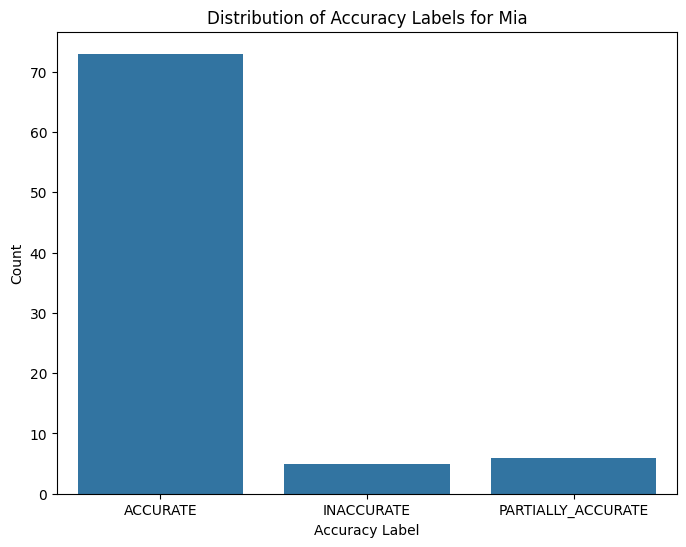

This project evaluates the responses of various chatbots using LLM as Judge to measure the factuality of the response and Cosine Similarity.The goal of this project was to evaluate how well four AI bots (Mia, Mike, Olivia, Bella) generated responses compared to expected target responses. For each question, we had:

* A target response (the correct or expected answer)
* A bot response (generated by each bot)
* A cosine similarity score (which measures the semantic closeness of the bot response to the target response)
The evaluation was conducted in two main steps:

## LLM as a Judge
LLM as a Judge is using LLMs to evaluate the responses of the bots, in comparison to the expected output. The responses are sent to an LLM with an evaluation prompt, and then ask the LLM to compare the response to the expected response, and score the response in three classes, Accurate, Partically Accurate, and Inaccurate. Responses were classified into three categories—ACCURATE, PARTIALLY ACCURATE, and INACCURATE—based on how closely the bot responses aligned with the target responses, and also an explantion on why the response belongs to that particular category.

## Cosine Similarity
We calculated the average cosine similarity for each accuracy category to quantify the semantic similarity between the bot responses and target responses.
The evaluation is based on cosine similarity between the bot's responses and the expected response. Cosine similarity is used in this context to measure the semantic similarity between the the bot responses and the expected response. 

### How it works:
* Text Conversion: Both the bot's responses and the expected responses are converted into numerical representations (vectors).The sentence_transformers library is used to convert text into numerical embeddings.

* Vector Calculation: These numerical representations are then converted into vectors in a high-dimensional space.The cosine of the angle between these two vectors is computed. A value closer to 1 indicates a higher similarity between the two signatures, while a value closer to 0 indicates lower similarity.

# Data Structure
The dataset we analyzed contains multiple columns for each bot, including:

* Question: The question posed to the bot.
* Target Response: The expected answer for each question (specific to each bot).
* Bot Response: The response generated by the bot.
* Cosine Similarity: The cosine similarity score between the target response and the bot response.
* Accuracy: The label assigned to each bot's response, indicating whether it was ACCURATE, PARTIALLY ACCURATE, or INACCURATE.
* Explanation: A brief description of why a particular accuracy label was assigned.

Each bot (Mia, *Mike, Olivia, Bella) had its own set of responses, target responses, cosine similarity scores, and accuracy labels.

# Accuracy Evaluation
Evaluated the accuracy of each bot's responses using the following three categories:

ACCURATE: The bot response was completely factually correct and aligned with the target response.
PARTIALLY ACCURATE: The bot response was somewhat correct but contained either partial misinformation or lacked full details.
INACCURATE: The bot response was factually incorrect or contradicted the target response.

## Accuracy Distribution
The distribution of accuracy levels for each bot was as follows:

