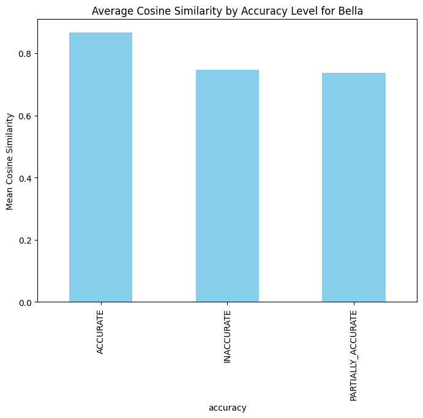

This project aims to evaluate the factual accuracy and semantic similarity of responses generated by four AI chatbots—Mia, Mike, Olivia, and Bella—using two primary evaluation methods: LLM as Judge and Cosine Similarity. The objective is to determine how closely each bot’s responses match the expected target responses, both semantically and factually.

## Key Components:
For each question in the dataset, the following elements were used:

* Target Response: The expected (correct) answer to the question.
* Bot Response: The generated response by each AI bot.
* Cosine Similarity Score: Measures how semantically similar the bot’s response is to the target response.
The evaluation was conducted in two stages:

1. LLM as a Judge: Leveraged a language model to classify responses as ACCURATE, PARTIALLY ACCURATE, or INACCURATE.
2. Cosine Similarity Analysis: Measured the semantic similarity between the bot and target responses using cosine similarity.

# Data Structure
The dataset we analyzed contains multiple columns for each bot, including:

* Question: The question posed to the bot.
* Target Response: The expected answer for each question (specific to each bot).
* Bot Response: The response generated by the bot.
* Cosine Similarity: The cosine similarity score between the target response and the bot response.
* Accuracy: The label assigned to each bot's response, indicating whether it was ACCURATE, PARTIALLY ACCURATE, or INACCURATE.
* Explanation: A brief description of why a particular accuracy label was assigned.

Each bot (Mia, Mike, Olivia, Bella) had its own set of responses, target responses, cosine similarity scores, and accuracy labels.

# Evaluating Semantic Similarity using Cosine similarity
Cosine similarity is a measurement that quantifies the similarity between two or more vectors. It is the cosine of the angle between vectors. A score closer to one, means the angle between two vectos is smal, which means they are more similar.
### How Cosine Similarity WOrks
1. Text Embeddings: Both the bot responses and target responses were converted into numerical embeddings using the sentence_transformers library.
2. Vector Calculation: These embeddings were represented as vectors in a high-dimensional space.
3. Cosine Similarity Score: The cosine of the angle between the two vectors was computed. A higher score indicates a stronger semantic alignment between the two texts.

Cosine Similarity effectively captures the orientation or direction of the vectors and not their magnitude, making it reliable measure of similarity in texts of varying lengths.
### Results
The evaluation is based on cosine similarity between the bot's responses and the expected response. Cosine similarity is used in this context to measure the semantic similarity between the the bot responses and the expected response. 
| Bot    | Mean Cosine Similarity | Standard Deviation | Minimum | Maximum |
|--------|------------------------|--------------------|---------|---------|
| Olivia | 0.8978                 | 0.1135             | 0.3694  | 1.0000  |
| Mike   | 0.8367                 | 0.1595             | 0.1473  | 1.0000  |
| Bella  | 0.8361                 | 0.1734             | 0.1887  | 1.0000  |
| Mia    | 0.8269                 | 0.1881             | 0.1749  | 1.0000  |

* Olivia had the highest mean cosine similarity, indicating that her responses were, on average, the most semantically similar to the expected answers.Also, her responses were consistent due to her low standard deviation score, making her the best-performing bot overall.
* Mike and Bella had similar average performance but exhibited more variation in response quality.
* Mia had the lowest mean similarity, showing that her responses were the least semantically aligned with the target responses.

## Analysing Cosine Similarity Distribution
The whole analysis can be found here [Cosine_Similarity_Analysis.ipynb](Cosine_Similarity_Analysis.ipynb)
Visualising the distribution of the cosine similarity scores:

The distribution is skewed to the right, meaning there are more responses with higher cosine similarity scores (closer to 1) compared to lower scores. This indicates that Bot Olivia generally produces responses that are highly similar to the expected outputs.
The histogram peaks around 0.9, suggesting that a majority of responses have a cosine similarity score close to 1. This is a positive sign, as it indicates that the bot is consistently generating relevant and accurate responses.
The presence of a tail on the left side indicates that there are a few responses with lower cosine similarity scores. These could be outliers or instances where the bot's response was less aligned with the expected output.

Cosine similarity scores distribution for Mike:

 
The distribution is skewed to the right, meaning there are more responses with higher cosine similarity scores (closer to 1) compared to lower scores. This indicates that Bot Mike generally produces responses that are similar to the expected outputs.
Compared to Bot Olivia's distribution, Mike's histogram has a longer tail on the left side. This indicates that there are more responses with lower cosine similarity scores, suggesting a higher degree of variability in Mike's responses.

Cosine similarity scores distribution for Bella:

 
 While Bot Bella's distribution also shows a rightward skew and a peak around 0.9, the longer tail on the left suggests that its performance is less consistent compared to Bot Olivia. There are more instances where Bella's responses deviate from the expected outputs to a greater extent.

Cosine similarity scores distribution for Mia:

 
 Mia’s distribution shows the most significant spread, indicating a higher variability in response quality and less consistency compared to the other bots.

## Observation
High cosine similarity scores indicate that a bot's responses are semantically similar to the target responses, but they don't always guarantee accuracy.. A bot might generate a response that is semantically similar but misses the intended meaning due to lack of context. This is because Cosine similarity measures the angle between two vectors (e.g., between a bot’s response vector and the expected response vector). This metric tells us how similar the direction of the two vectors is. In this context, a high cosine similarity score means that the bot’s response uses similar words or has a similar semantic meaning to the expected response.
Examples :
Fact-Based Questions: If the bot’s response is semantically similar but factually incorrect, the cosine similarity might still be high.
Question: "What is the capital of France?"
Expected Response: "The capital of France is Paris."
Bot Response: "The capital of France is Lyon."
Here, the cosine similarity might be high because the words and structure are similar, but the answer is incorrect.

Different Sentence Structures: Sometimes, a response can have different sentence structures or a different phrasing but still be accurate, Like the Question of Age, for all the bots.

Expected Response: "25."
Bot Response: "I am 25 years old."
The cosine similarity might be lower due to different wording, but the answer is still correct and accurate.

Repetition or Irrelevance: If a bot outputs longer, repetitive responses, it might achieve high cosine similarity, even if much of the content is irrelevant, Like the case of Mike where he often adds extra information or follow-up questions.

High similarity may not capture contextual appropriateness, Like in the case where the bot's reponses show uncertaininty, the cosine similairity can be high, but less accurate than expected.

# Evaluating Accuracy using LLM As a Judge
In this method, each bot’s response was compared to the expected response using a large language model (LLM). The LLM analyzed how closely the bot’s answer matched the target and classified the responses into three categories:

* ACCURATE: Fully aligns with the target response.
* PARTIALLY ACCURATE: Partially correct but missing key information or containing some inaccuracies.
* INACCURATE: Factually incorrect or significantly misaligned with the target response.
### How It Works:
The bot responses were sent to the LLM along with the expected answers using a carefully designed evaluation prompt. The LLM then assessed and assigned an accuracy label based on the factual alignment and provided an explanation for each classification.

## Accuracy Distribution
The distribution of accuracy levels for each bot was as follows:

 . 

Mia's Percentage of Responses by Accuracy Level was as follows: 

Mia has a strong performance with 73 accurate responses which is 86.9%, showing that most of her answers closely align with the target responses.
Only 5 responses are marked as inaccurate which is 6%, meaning Mia generally provides semantically correct answers, with minimal mistakes.
Few Partially Accurate Responses: There are 6 cases where Mia's responses are somewhat correct but contain either minor inaccuracies or incomplete information.
Mia is performing well overall, with the majority of responses (close to 90%) being accurate or partially accurate. The bot seems to struggle minimally with inaccurate answers.

 
Bella's Percentage of Responses by Accuracy Level was as follows: 

Bella performs similarly to Mia and Olivia, with 64 responses being accurate(76.2%), which suggests strong alignment with the target answers.
Bella has 13 partially accurate responses (15.5%), which is higher than Mia and Olivia, indicating that Bella sometimes provides answers that are somewhat correct but may miss some details.
Bella has only 7 inaccurate responses (8.3%), a relatively small number compared to Mike, showing that Bella makes fewer errors overall.
Conclusion:
Bella exhibits high accuracy, with (76.2%)her responses being accurate or partially accurate. The low number of inaccurate responses indicates that Bella generally provides reliable answers.

 

Olivia's Percentage of Responses by Accuracy Level was as follows:

Olivia demonstrates solid performance, with 65 responses classified as accurate, indicating high alignment with the target answers.
Olivia's 12 inaccurate responses suggest occasional errors, but they are relatively infrequent.
Similar to Mia, Olivia has a small number of responses (7) that fall between accurate and inaccurate, indicating that her understanding is generally strong but sometimes incomplete.
Olivia shows a high level of accuracy, with 77.4% of her responses being accurate. However, the presence of 12 inaccurate responses points to areas where the model could be improved.

 

Mike's Percentage of Responses by Accuracy Level was as follows:

Mike's responses are more evenly distributed across the accuracy categories compared to Mia. While 34 answers are accurate which accounts to 40.5%, nearly as many (27) are only partially accurate whci is 32.1%, and 23 responses are fully inaccurate which is 27.4%.
With 23 inaccurate responses, Mike demonstrates a much higher tendency to generate incorrect answers compared to Mia, suggesting either misunderstandings or significant deviations from the target answers.
Mike seems to often generate responses that are somewhat correct but lack full alignment with the target answers due to the Large Proportion of Partially Accurate Responses which is 32.1%
Mike's performance is mixed, with nearly 50% of his responses being inaccurate or partially accurate.

In summary:
* Mia had 86.9% accurate responses, indicating a strong performance.
* Bella and Olivia were slightly lower, with 76.2% and 77.4% accuracy, respectively.
* Mike struggled the most, with only 40.5% accurate responses and 27.4% of his responses being fully inaccurate.

## Average Cosine Similarity By Accuracy Level
 Categorised the accuracy levels and calculated the average cosine similarity:

 . 

A cosine similarity of 0.846 for accurate responses suggests that Mia's accurate answers are semantically very close to the target responses.
There is A significant drop to 0.600 for inaccurate responses indicates that when Mia gets the answer wrong, the semantic similarity between her answer and the target drops substantially.
The cosine similarity for partially accurate responses is 0.777, which shows that even when Mia's answers are not fully correct, they are still somewhat semantically close to the target.
Mia's cosine similarity values align with the accuracy levels, with a clear drop in similarity for inaccurate answers, showing a good relationship between semantic similarity and response accuracy.

Olivia's accurate responses have the highest cosine similarity among the bots, with a value of 0.916, indicating that her correct answers are very close to the target responses in meaning.
Even her inaccurate responses maintain a high cosine similarity (0.852), suggesting that her mistakes are not drastically different from the target answers.
Olivia's partially accurate responses have a lower cosine similarity (0.799), but it still shows a strong semantic relationship with the target.
Olivia's high cosine similarity across all categories highlights her strength in maintaining semantic closeness, even when the answers are not fully accurate.

Bella's accurate responses have a high cosine similarity of 0.865, reflecting strong semantic alignment with the target.
A cosine similarity of 0.747 for inaccurate responses indicates a significant reduction in similarity when Bella gets the answers wrong, more so than Mia or Mike.
Bella’s partially accurate responses have a cosine similarity of 0.737, which shows that there’s a notable difference between her answers and the target responses when they are not fully correct.
Bella’s performance, in terms of cosine similarity, follows a more standard pattern, with the highest similarity for accurate responses and a marked drop for both partially accurate and inaccurate responses.

Interestingly, Mike has high cosine similarity even for inaccurate responses (0.791). This suggests that even when Mike's answers are wrong, they remain semantically close to the target.
The highest cosine similarity is for partially accurate responses (0.873), meaning that Mike's answers in this category are closer in terms of semantics, even though they may not be fully correct.
Unlike Mia, Mike's inaccurate responses still have relatively high semantic similarity, which suggests that the mistakes might not be due to semantic errors but rather specific factual inaccuracies.
Mike's performance is somewhat unique, as even his inaccurate responses maintain a high degree of semantic similarity. This could imply that his mistakes are subtle and not as noticeable in terms of semantic content.

Mike’s responses are generally well-structured and have a high degree of semantic similarity to the expected answers.
However, the fact that his inaccurate responses are also scoring high on cosine similarity suggests that Mike may produce responses that are “close but not quite correct”.
This pattern could indicate a tendency to generate plausible but subtly incorrect answers, making him prone to errors that are harder to detect with standard similarity metrics.

